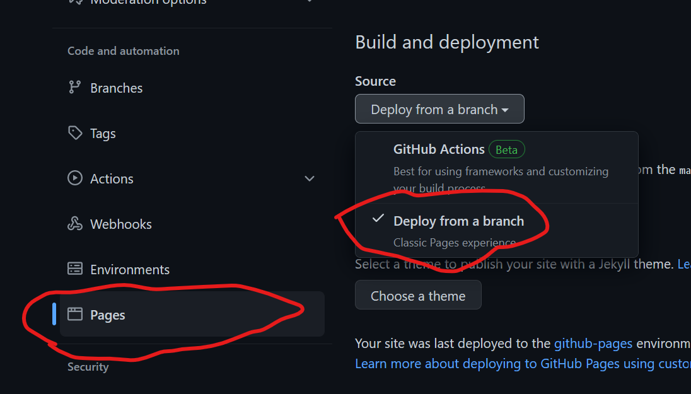

# wrobel-template

template website from [Jessica Wrobel's personal website](http://juliawrobel.com/)

## Prereqs:
- R
- rmarkdown package

## Usage and Modifications
- use this template
  - [fork the repo!](https://github.com/cvraut/wrobel-template/fork)
- make changes
  - Specific page
    - go to `.Rmd` file
    - use your favorite text editor to make changes (supports rmd style markup)
  - Navbar
    - go to `_site.yml`
      - change titles, homepage, tabs, icons, links
- render
  - open the project in Rstudio
  - `rmarkdown::render_site()`
    - this builds all the html files from rmd files
- publish changes
  - use git to add all changed files to github
  - deploy to github pages by enabling it in settings (first time only)
  - 
  - push changes to branch selected in settings

## Trouble-shooting

If something doesn't work, raise an issue on [cvraut/wrobel-template](https://github.com/cvraut/wrobel-template/issues/new/choose)

If you like the template pls leave me a ⭐